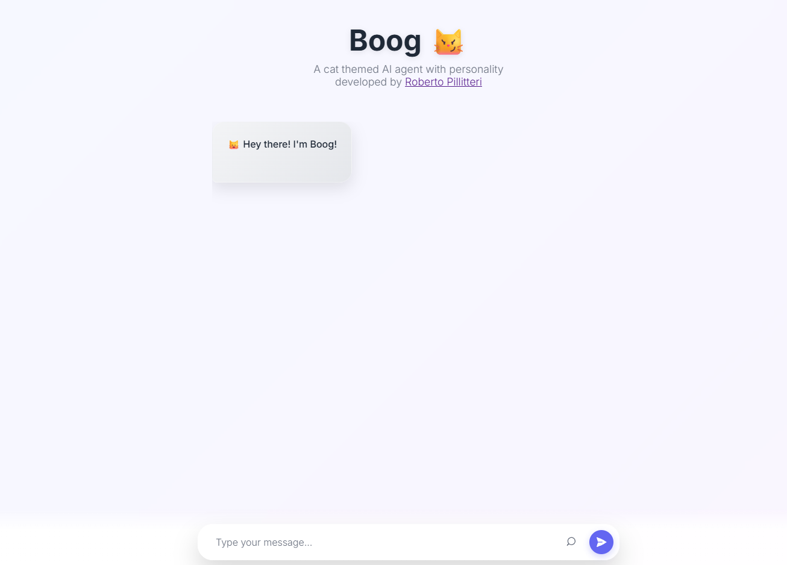

# Boog🐱

[](https://www.python.org/)
[](https://flask.palletsprojects.com/)
[](https://groq.com/)
[](https://heroku.com/deploy)

Boog is a lightweight **AI agent** built with in **Python** and **Flask**, integrating **GPT-OSS 120B** for natural conversations and **Web Search** for up-to-date, reference-backed answers.
It features a clean and fast frontend UI and can be deployed easily to **Heroku** or similar platforms.
## 🎮 Demo

You can try out Boog live here: 👉 [Boog Demo on Heroku](https://boog-gpt-a52a0df7bf72.herokuapp.com/)

<p align="center">
  
</p>

## 🚀 Features

* **Conversational AI** – chat with Boog 🐱.
* **Web Search mode** – integrates with web search to provide factual, reference-backed answers (similar to Perplexity).
* **Frontend** – responsive chat interface with async handling and cat-themed branding.
* **Backend** – Flask backend with clean JSON API.
* **Deployment ready** – configured with `Procfile` for Heroku.

---

## 📂 Project Structure

```
Boog-main/
├── Procfile              # For Heroku deployment
├── README.md             # Project documentation (this file)
├── app.py                # Flask backend
├── requirements.txt      # Python dependencies
├── static/
│   └── boog.css          # Custom CSS for the UI
└── templates/
    └── index.html        # Chat frontend
```

---

## ⚙️ Installation

1. **Clone the repo**

   ```bash
   git clone https://github.com/robitec97/Boog.git
   cd Boog
   ```

2. **Create a virtual environment & install dependencies**

   ```bash
   python -m venv venv
   source venv/bin/activate   # On macOS/Linux
   venv\Scripts\activate      # On Windows

   pip install -r requirements.txt
   ```

3. **Set environment variables**

   ```bash
   export GROQ_API_KEY="your-groq-api-key"
   export TAVILY_API_KEY="your-tavily-api-key"
   ```

4. **Run locally**

   ```bash
   python app.py
   ```

   Visit 👉 `http://127.0.0.1:5000`

---

## 🌐 Deployment (Heroku)

1. Login to Heroku:

   ```bash
   heroku login
   ```

2. Create an app:

   ```bash
   heroku create boog-agent
   ```

3. Set environment variables:

   ```bash
   heroku config:set GROQ_API_KEY="your-groq-api-key"
   heroku config:set TAVILY_API_KEY="your-tavily-api-key"
   ```

4. Push to Heroku:

   ```bash
   git push heroku main
   ```

5. Open the app:

   ```bash
   heroku open
   ```

---

## 🔑 API Endpoints

* **`GET /`** → Chat UI (HTML)
* **`POST /chat`**

  ```json
  {
    "message": "Hello!",
    "mode": "ai" | "web"
  }
  ```

  **Response:**

  ```json
  {
    "response": "Hello, how can I help you?"
  }
  ```


## 🐱 Why “Boog”?

The project name is actually my cat's name **Boog 🐱**

---

## 🛠️ Tech Stack

* **Backend**: Flask, Groq API, Tavily API
* **Frontend**: HTML, CSS
* **Deployment**: Heroku

---

## 📜 License

This project is licensed under the Apache License 2.0.  
You are free to use, modify, and share this project, but you must give **appropriate credit** to the original author [robitec97](https://github.com/robitec97).


